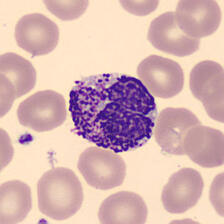
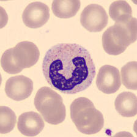
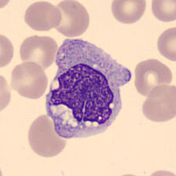
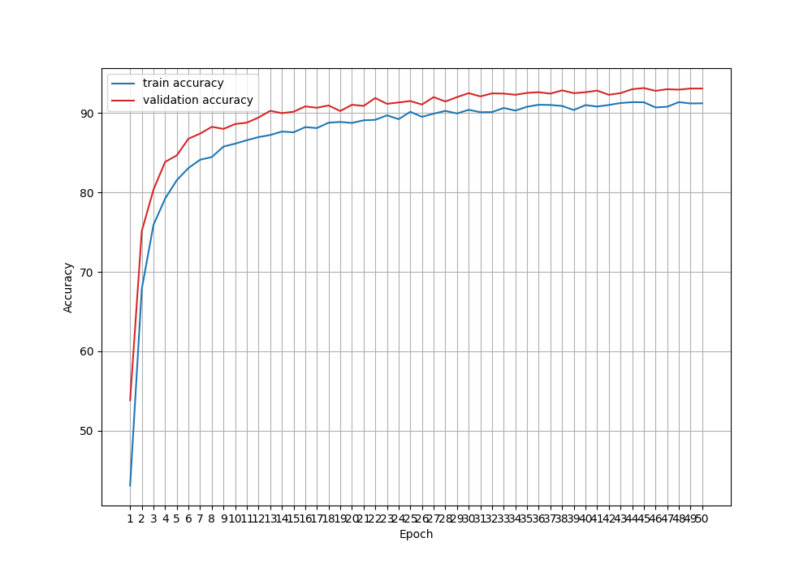
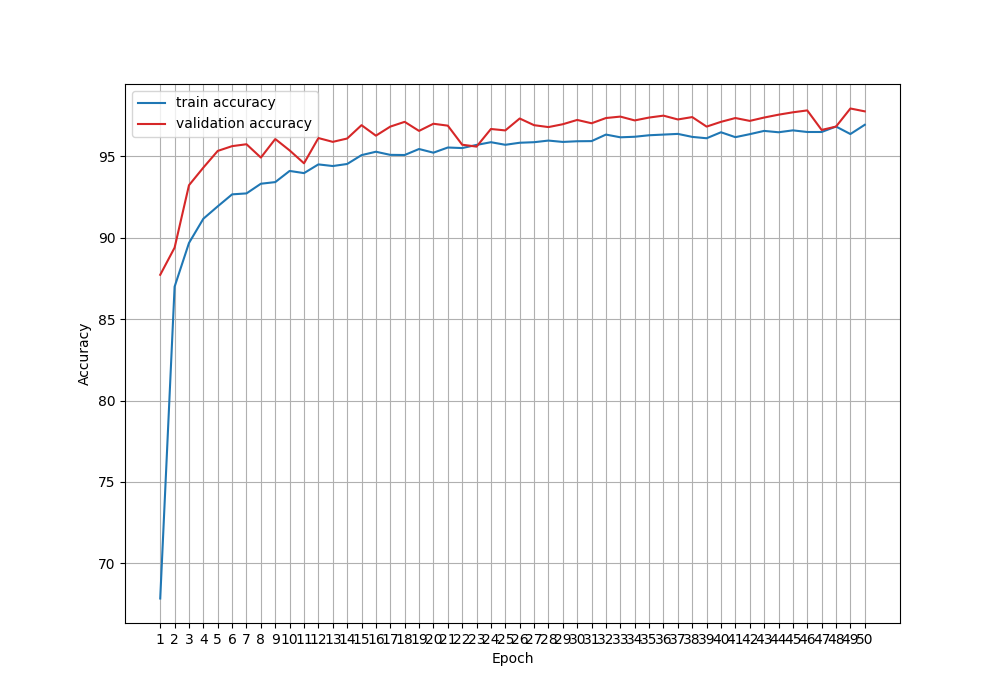

## Training DINOv2 for the classification of Peripheral Blood Cells

### Introduction
Peripheral blood is a term used to describe blood that 
circulates through the body and it is not confined to a 
specific organ. An analysis of peripheral blood cell 
morphology is often the starting point for the 
assessment of hematological diseases [1]. 

In [1], the authors describe a dataset of 
peripheral blood cell images (jpg) extracted from patients 
without infections, hematologic or oncologic diseases and 
free of any pharmacologic treatment. The cell images are 
have been classified according to their type by 
clinical pathologists. In [2], the authors describe the use  
of convolutional neural networks (CNN) trained to recognize 
automatically the different cell types. 

In this repository, we include the code to perform the 
same task using a more modern DINOv2-based classifier. 
DINOv2 is a vision foundation model developed by Meta and 
released in April 2023 [3]. The code in this repository is a 
slightly modified version of [4] for improved usability.

### Dataset
The dataset consists of 17,092 images of people's normal peripheral 
blood cells obtained from the Hospital Clinic of Barcelona. 
The 360x360-pixel images are categorized in 8 different classes 
according to their type: 
basophil, eosinophil, erythroblast, ig (i.e., immature granulocyte), 
lymphocyte, monocyte, neutrophil and platelet [1]. The images 
below show examples of basophil, netrophil, eosinophil, and monocyte 
cells.

The dataset can be downloaded from Kaggle using the link:
https://www.kaggle.com/datasets/bzhbzh35/peripheral-blood-cell?resource=download-directory

After downloading and unzipping the file, the data is stored in a 
root folder that has 8 subdirectories. Each subdirectory uses the 
cell type as a name and contains the corresponding images (jpg). 

   
  
  
   

### Dependencies

- matplotlib: Tested with version 3.10.0.

- numpy: Tested with version 2.2.3. Note: version 1.3.6 reports a type error 
related to a mismatch between np.ndarray and numpy.ndarray. 

- torch: The PyTorch module. Tested with version 2.6.0.

- torchvision: Tested with version 0.21.0.

- tqdm: Tested with version 4.67.1.

### Usage

#### Generate train, validation, and test datasets
Use `gen_trn_val.py` to partition the data in train, validation, and test subsets. 
Use the `-h` argument to determine required and optional arguments. 

The script generates an output root directory, which contains `TRN`, `VAL`, and `TST` 
folders. Each folder contains 8 subdirectories, one per class. The class subdirectories 
contain the jpg images. 

#### Train a DINOv2 model using either fine-tuning or transfer-learning
Use `train.py` to train a DINOv2 model to classify peripheral blood cells. Use the `-h` 
option to find the required and optional arguments. The script needs the input data 
directory and generates results in an output directory. 

The code currently uses the pre-trained ViT-S/14 model available from Meta repositories. 
With 21 million parameters, this is the smallest model from the family. The model 
is pre-trained using ImageNet data. By default `train.py` will train the model using 
transfer learning, that is, we only train a final linear classification layer added 
to the model. However, the flag`--fine_tune`enables training of all layers.

#### Perform inference using a trained DINOv2 model
Use `infer.py` to perform inference on all images stored in a directory. 
Use the `-h` options to find required and optional arguments. The script 
needs an input directory of images and a trained model `.pth` file. The 
results can be displayed on screen or saved to a CSV file.

### Results
The code in this repository implements a pre-trained DINOv2 with an additional linear layer 
for classification of features vectors. The model can be trained with data like peripheral 
blood cells using transfer learning
(i.e., only the final layer is optimized) or using fine-tuning (i.e. all layers are optimized). 
The dataset was split in training, validation, and testing with ratios of 70/20/10, but for 
the initial experiments described here, we only used the train and validation subsets.

The results of both approaches are comparable and exceed 90% in validation accuracy, with the fine-tuned 
model having a better performance (~98%) compared to the model trained via transfer learning (~92%). 
The figures below show obtained learning curves for transfer learning (left) and fine-tuning (right).
Please note that the y-axis of the images does not use the same scale.

The authors that compiled the dataset tested the use of convolutional neural networks for 
classification [2]. They used two models: VGG-16 and InceptionV3. These models 
were trained using two modes: (1) As feature-vector extractors with vectors classified using a 
support vector machine (SVM), and (2) as CNNs that directly classify images. In the first 
case, they obtained accuracies of 86% (VGG-16) and 90% (InceptionV3), and in the second case the 
results were 96% (VGG-16) and 95% (InceptionV3). Based on these results, training a pre-trained 
DINOv2 model using fine-tuning seems to provide a superior accuracy than the use of conventional 
CNNs.

   
  

### References
[1] A. Acevedo, A. Merino, S. Alférez, A. Molina, L. Boldú 
and J. Rodellar, "A dataset of microscopic peripheral blood 
cell images for development of automatic recognition systems.",
Data in Brief, Vol 30, 2020

[2] A. Acevedo, S. Alférez, A. Merino, L. Puigví and J. Rodellar, 
"Recognition of peripheral blood cell images using 
convolutional neural networks", Computer Methods and Programs in 
Biomedicine, Vol. 180, 2019

[3] M. Oquab et al., "DINOv2: Learning Robust Visual 
Features without Supervision", arXiv:2304.07193

[4] Sovit Ranjan Rath, "DINOv2 for Image Classification: Fine-Tuning
vs Transfer Learning", online publication, 2025.
https://debuggercafe.com/dinov2-for-image-classification-fine-tuning-vs-transfer-learning/
